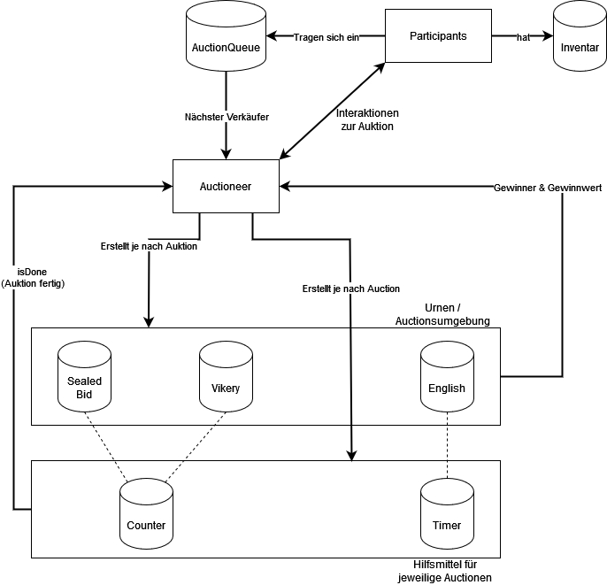
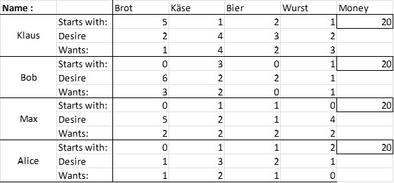

## Übersicht
1. [Allgemeine Informationen](#allgemeine-informationen)
2. [Technologien](#technologien)
3. [Installation](#installation)
4. [Verwendung](#verwendung)
5. [Projekt Teilnehmer](#projekt-teilnehmer)
6. [Weitere Informationen](#weitere-informationen)

## Allgemeine Informationen
***
Das Projekt **mas_auction** ist ein Multiagentensystem für die Simulation von Auktionen mit flexibler anzahl an Teilnehmern.
Dabei gibt es die beiden Hauptakteure Auktionator und Teilnehmer. Der Autkionator ist für die Druchführung und Verwaltung der Auktionen zuständig, während die Teilnehmer sowohl Verkäufer als auch Käufer darstellen können.

Erstellt wurde das Projekt in dem Modul Multiagentensysteme. Als Grundlage dazu wurde das Buch: [Multi-Agent Oriented Programming](https://hds.hebis.de/thm/Record/HEB486480208) verwendet.

**Kernaspekte :**
* Teilnehmer können Verkäufer als auch Käufer sein
* Es ist nur eine gleichzeitige Auktion möglich
* Es kann aus drei verschiedenen Auktionstypen eine ausgewählt werden (English Auction, Sealed Bid Auction, Vickery Auction)
* Teilnehmer bieten für eine Auktion so viel wie ihnen der Gegenstand der aktuellen Auktion wert ist & besitzen eine Hapiness Funktion die dazu beiträgt
* Teilnehmer können selbst entscheiden mit welchem Auktionstypen sie Verkaufen möchten (Funktion dafür ist implementiert, Teilnehmer nutzen diese allerdings noch nicht richtig)

**Aufbau des Systems :**




## Technologien
***
Das Project basiert hauptächlich auf dem [JaCaMo](http://jacamo.sourceforge.net) Framework für Multiagentensysteme. Das Framework führt dabei die drei Frameworks / Interpreter [Jason](http://jason.sourceforge.net/wp), [CArtAgO](http://cartago.sourceforge.net) und [Moise](http://moise.sourceforge.net) zusammen. Alle wurden mit unterschiedenlichen Schwerkpunkten in der Entwicklung von Multiagentensystemen entwickelt. Durch [JaCaMo](http://jacamo.sourceforge.net) kann man die Vorteiler aller drei Frameworks nutzen.

Für das Projekt wurden hauptsächlich Funktionen aus [Jason](http://jason.sourceforge.net/wp) und [CArtAgO](http://cartago.sourceforge.net) in Verbindung mit [JaCaMo](http://jacamo.sourceforge.net) genutzt.
Als Entwicklungsumgebung wurde [Eclipse](https://www.eclipse.org/) verwendet, da [JaCaMo](http://jacamo.sourceforge.net) als Plugin aktuell nur für diese IDE verfügbar ist und nur so genutzt werden kann. Alle der Frameworks nutzen dabei Java als Basis. Dahingehen wurde auch Java für dieses Projekt genutzt. Besonders zum erstellen von Artefakten für [CArtAgO](http://cartago.sourceforge.net) wurde Java Code verwendet.

Eine Liste der Technologien die für das Projekt verwendet wurden:
* [JaCaMo](http://jacamo.sourceforge.net):  Version 0.9
* [Eclipse](https://www.eclipse.org/): Version 2020-9
* [Java](https://example.com): Version 8
* [Git](https://git-scm.com) & [GitLab](https://about.gitlab.com)

## Installation
***
Um das Projekt **mas_auction** installieren bzw. nutzen zu können muss zuerst die [JaCaMo](http://jacamo.sourceforge.net) Umgebung installiert und eingerichtet werden. Dazu gibt es von den Erstellern ausfühliche Anweisungen bzw. Anleitungen.

**Eclipse installieren :**
* siehe [Insallationsguide Eclipse](https://www.eclipse.org/downloads/packages/release/2020-09/r) für Eclipse Version 2020-09

Wir verdenden hier eine ältere Eclipse Version da es bei Neueren Version stellenweise zu Problemen kam. Neuere Versionen sollten jedoch nach Angaben der Entwickler auch Funktionieren.

**JaCaMo installieren :**

* siehe [Installationsguide JaCaMo](http://jacamo.sourceforge.net/doc/install.html) - und dort dann [Eclipse Plugin](http://jacamo.sourceforge.net/eclipseplugin/tutorial/)

Nach dieser Anleitung ist es möglich JaCaMo Projekte zu erstellen, auszuführen & zu vorhandene zu importieren.
* siehe [JaCaMo Projekte Importieren](http://jacamo.sourceforge.net/eclipseplugin/tutorial/#id.1cnwcumx5214)

#### **mas_auction installieren**

Eine Anleitung wie man **mas_auction** installiert :

Man muss das Projekt zuerst aus GitLab herunterladen und in dem installierten Eclipse Workspace speichern. Dazu gibt es zwei verschiedene Möglichkeiten.
```
Erste Möglichkeit: 
$ git clone https://git.thm.de/dzmm38/mas_auction.git

Zweite Möglichkeit:
oder als .zip Datei herunterladen und dann in dem Workspace entpacken.
```
Nun kann Eclipse mit dem installierten JaCaMo Plugin gestartet werden und als Workspace soll der Platz gewählt werden in dem das heruntergeladene Projekt liegt. Jetzt kann das Projekt als JaCaMo Projekt importiert werden.
* Anleitung zum Importieren einer JaCaMo anwendung: [JaCaMo Projekte Importieren](http://jacamo.sourceforge.net/eclipseplugin/tutorial/#id.1cnwcumx5214)

## Verwendung
***
Nachdem das Projekt importiert wurde, siehe [mas_auction installieren](#masauction-installieren) kann das Programm gestartet bzw. verwendet werden. Dazu muss die **mas_auction.jcm** Datei ausgeführt werden. Hierzu mit einem Rechtsklick auf der Datei, dann **Run JaCaMo Application** drücken.

**Setup von neuen Teilnehmern :**

In der jcm Datei werden alle Akteure und Artefakte die zum Starten des Programms benötigt werden erstellt. Um neue Teilnehmer hinzuzufügen die dann auch an Auktionen Teilnehmen können, müssen diese in der jcm zunächst defeiniert, bzw. angelegt werden.


Hinzufügen weiterer Teilnehmer :
```
agent <Name des neuen Teilnehmer> : participant.asl{
    join : auctionTable
}
```

#### **Ausführen von Testcases :**
Die definierten Testcases mit den jeweiligen erwarteten Ergebnissen finden sich [hier](#verwendete-testcases). Um die Testcases auszuführen bzw. zwischen ihnen und der nicht definierten Simulation zu wechseln, benötigt es aktuell etwas aufwand. Dazu müssen in dem Artefakt **Inventory** unter **src/env/tools/Inventory.java** die für das Testcase zuständigen Zeilen auskommentiert bzw. kommentiert werden. 

Testcase 1 :

**TODO**

Testcase 2 :

**TODO**

Standard Simulation :

**TODO**

## Projekt Teilnehmer
***
An dem Projekt **mas_auction** des Moduls **Multiagentensysteme** haben folgenten Teilnehmer mitgewirkt :

* Dennis Zimmer
* Tim Uhlemann
* Erik Damm
* Sebastian Kirchner
* Maximilian Hönig

Die Teilnehmer wurde in zwei Gruppen (Auctioneer & Participant) aufgeteilt und haben sich hauptsächlich um implementation der beiden Hauptakteure einer Auktion und deren nötiger Hilfsmittel etc. gekümmert. Weitere Aufgaben wurden unabhängig der Gruppen zugeteilt und erledigt.

| Team Auctioneer | Team Participant |
|:--------------|:-------------:|
| Dennis Zimmer | Erik Damm |
| Tim Uhlemann | Sebastian Kirchner |
|  | Maximilian Hönig|

## Weitere Informationen
***
**Funktionsweise :**

Eine Detaillierte Dokumentation bzw. Beschreibungen sind als Kommentare im Code selbst vorhanden. Pläne und Beliefs werden dort in ihrem Zweck erläutert etc.

**Hapiness Funktion :**

Die Hapiness Funktion definiert wie der Teilnehmer sein Inventar bewertet & wie zufrieden bzw. glücklich dieser damit ist. Dabei haben die verschiedenen Gegenstände und Geld eine Unterschiedliche gewichtung für die Teilnehmer.
Die Berechnung der "Hapiness" wurde dabei mit folgender Funktion berechnet:
**TODO**

***
#### **Verwendete Testcases :**
Um das Programm bzw. System zu Testen wurden drei verschiedene Testcases erstellt und durchlaufen. 
Wie dieses Testcases ausgeführt werden können ist in [hier](#ausführen-von-testcases) beschrieben.
Die durchgeführeten Testcases werden nun mit den erwarteten Ergebnissen anfolgend aufgelistet.

Testcase 1:



**TODO** Restliche Testcases noch hinzufügen!!!!


